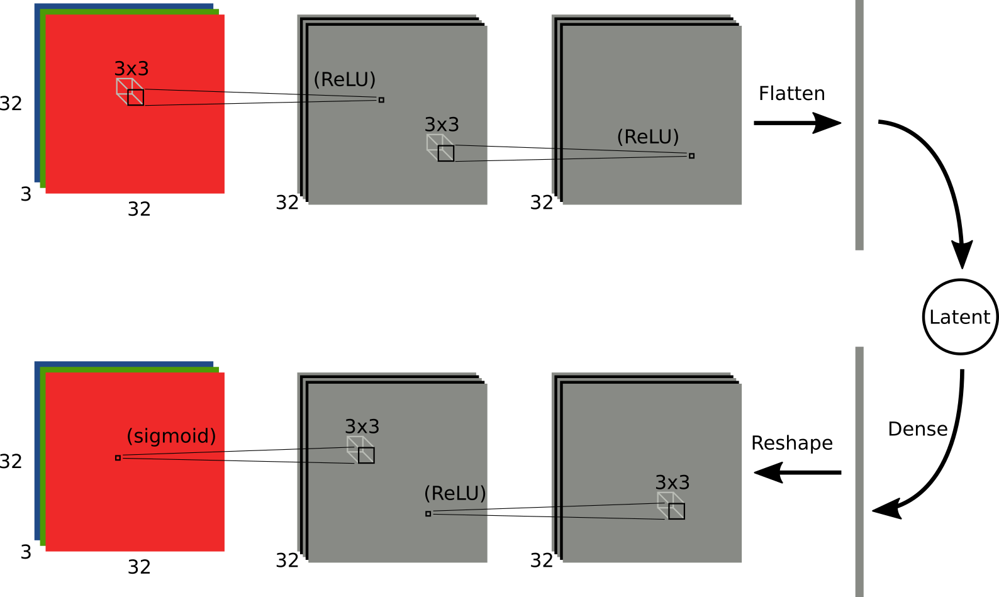

Exercise 05 - Convolution and Deconvolution
===========================================

Just as deep convolutional networks are better suited for image processing than fully-connected networks, we can use convolutional layers in a VAE for processing images. The CIFAR10 dataset contains 32x32 pixel color images of objects from 10 classes. Althought it is only slightly larger than MNIST in terms of pixels, it will suffice to demonstrate how a convolutional network can be used in this context.

The only code that needs to be written for this exercise is in `models.py` – fill in the `gaussian_cnn_cifar10()` function. The architecture will be very similar to the MNIST model, but with `Conv2D` layers instead of `Dense` layers. You will also need to be careful of the shape of tensors being passed to the latent layer and to the likelihood function. `Reshape` and `Flatten` layers will be useful for this.

Because training will take much longer in this model, I have pre-trained weights that can be downloaded [here]() for a model with the following architecture:

If you recreate this architecture (same number of layers with the same shapes), you should be able to load my weights into your model to quickly see the visualization results.

Note: convolution is its own inverse
------------------------------------

Ideally the `q` model and `p` model will have complementary structure, such that anything "encoded" by the `q` model is "decodable" by the `p` model. If the `q` model processes images with convolutions, what should the `p` model do to invert this? The answer is to use convolutions of the same size in both directions.

This may be surprising at first. The logic is this: at each layer in the `q` model, a single 'pixel' at layer `L` receives input from a `width x width` patch of the previous layer `L-1`. Flipping this around, any given pixel on layer `L-1` contributed to the activation of a `width x width` square of pixels on layer `L`. So, the "fan in" from layer `L-1` to layer `L` implies a "fan out" of the same size going from layer `L` back to layer `L-1`.